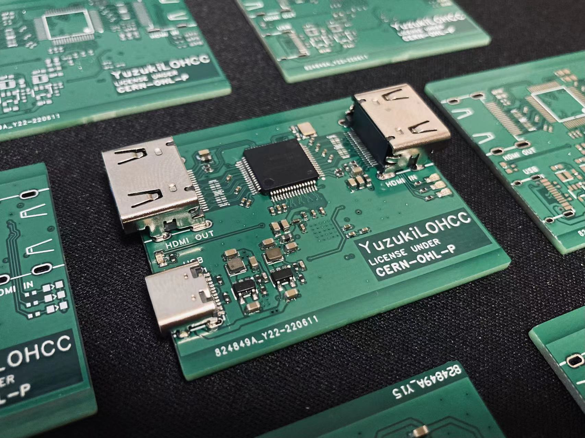

# YuzukiLOHCC

Yuzuki **L**oop **O**ut **H**DMI **C**apture **C**ard

Ultra low cost HDMI-USB Video Acquisition With Loop Out (Loop Out HDMI Capture Card)

## About

Ultra low cost Loop Out HDMI-USB Video Acquisition (HDMI Capture Card) based on MS2109 and MS9332 + MS8003

- Support HDMI 4Kx2K@30Hz and HDMI 2.0, YCbCr420 4Kx2K@60Hz Loop Out
- Support 10/12/16 bit Deep Color for Loop Out
- Adaptive input equalization for Loop Out
- Integrated pre-programmed HDCP keys for Loop Out
- Embedded EDID RAM for Loop Out

- Type C USB2.0 interface
- full height HDMI
- Compatible with DVI 1.0
- Supports HDCP 1.4 (no key provided in Firmware)
- Support YUV&JPEG output
- Compatible with UVC 1.0
- Support audio capture
- Support video capture
- Maximum video input 3840x2160@30
- The highest output resolution is 1920*1080@30

## Basic 

### Supported USB output resolution table

## Flash Firmware

Use an EEPROM flasher to flash the firmware before soldering.

## Links

OSHWHub OpenSource (Chinese): [https://oshwhub.com/gloomyghost/yuzuki-lohcc](https://oshwhub.com/gloomyghost/yuzuki-lohcc-hdmi-huan-chu-cai-ji-ka)

